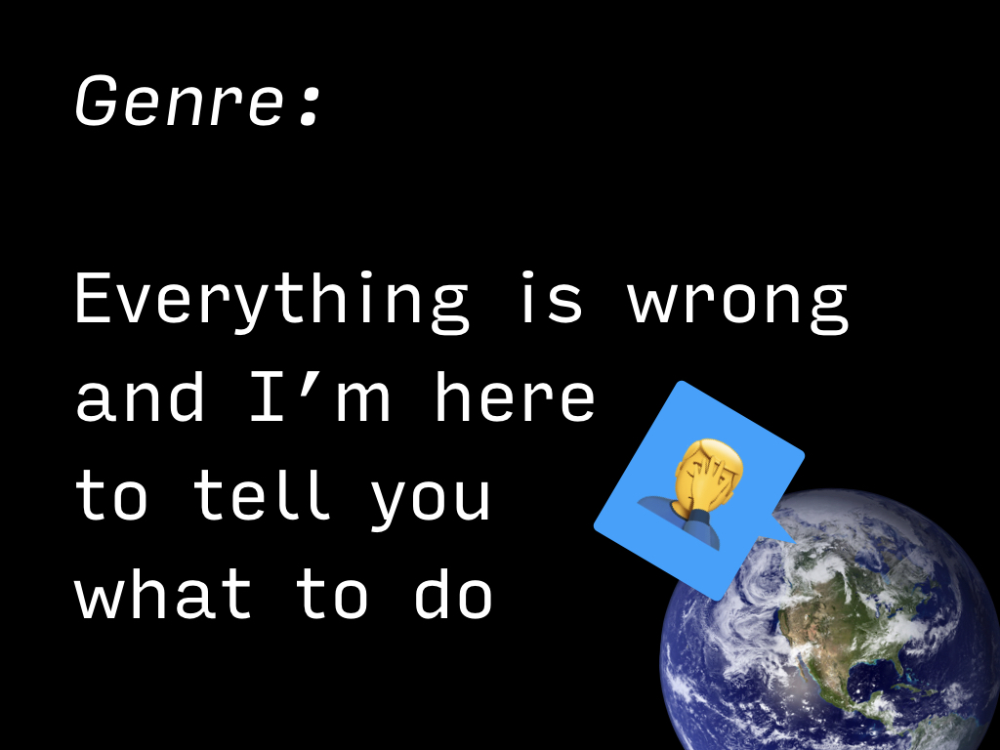
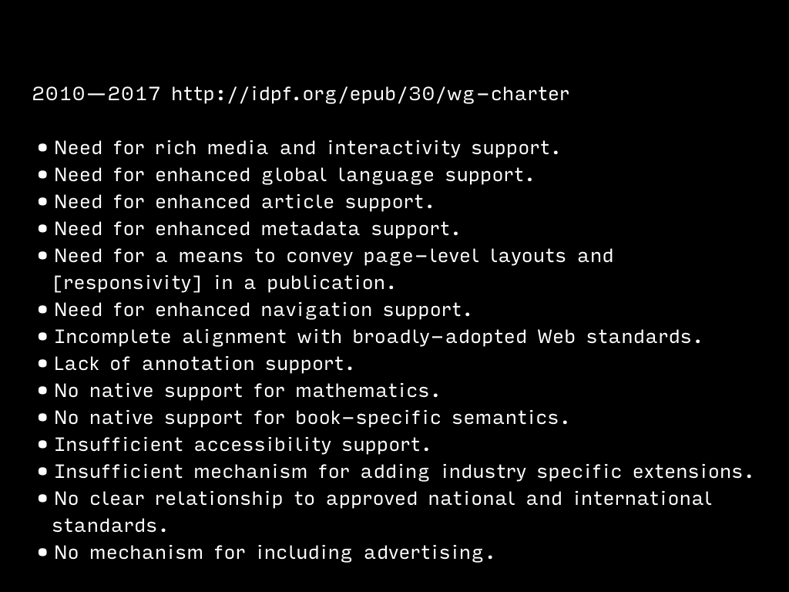

Many people have happy memories of reading their favorite book. So of course, let’s focus on that 
man on the right, reading on his blackberry.

This talk is consciously written as an answer to a big problem. And of course, I’m kinda humbled
by the size of it. But of course, I’ll tell you what I believe is the right solution.

People say that e-books are in a crisis. The Guardian is running a weekly column just to repeat that fact.

And they are not wrong. Electronic books are certainly aiming for a lower standard than printed ones. 
If you don’t carry too many of them, the experience is almost always better with a thick stack of bound
papers.

Though, most of the time, we’re used to perceiving it as a crisis of hardware. Paper is good, e-ink
not so much and that phone/tablet display is firing photon bullets right into your brain.

And yeah, book’s battery does not need to be synced, turned into an airplane mode, or recharged.

However, I believe it’s essential to see the bigger picture. Where did the book come from? 

What are the origins of a paperback? Isn‘t a solid stone tablet much nicer than some lousy paper?

What are the good things about a book beyond its pleasant smell and texture?

At the same time, we may start to distinguish between the electronic media: isn‘t the hi-res display somehow
better than that pixelated monstrosity from the dark epoch before 2012?

When did we got used to the fact that digital will never be as good as print? Wasn‘t it quite some time ago?

Seeing those temporal differences a bit more clearly, maybe the boundary between good and bad gets a bit fuzzier.

But still, the digital is kinda wonky. Why is it?

I believe the crisis is in the software.

We bathe in hardware news all the time. Displays, sensors, e-readers, processor cores,
larger phones, and more natural colors… and the software is playing catch-up. Mobile operating systems and their
ecosystems needed to mature, desktop systems stayed almost the same and that e-reader app (or OS on you e-ink e-reader)… 
it’s mostly the same as it was 10 years back, be it Kindle or iPad or something on your phone.

There are two big formats: EPUB and MOBI. (And a few others, such us plaintext and PDF, so-called “zombie-on-fire-formats.”)

The critical distinction is that EPUB is an open standard, while MOBI is Amazon’s own format for Kindle books. And of course, you cannot open EPUB on Kindle.

To make it funnier, when Apple developed an extended version of EPUB (with improvements targeting schools), they rebranded it
“iBook” and released their own editor that only can author iBooks.

Another thing is that EPUB lives aside from web standards. It was reasonable back in 2017 when hardware was weak and needed
a specific set of boundaries to be efficient (or so I think). The EPUB standard moves on slower than the web, so the world of HTML5 is
still something to be desired on most e-readers.

Right. I believe that the problem of e-books being *not good enough* is that of software being stuck somewhere 
far away from today’s standards. 

How does this react to the hardware-centric criticism above? Please wait a moment, I’ll show you how.

As the name of the talk implies, I believe that the solution is to publish books on the open web. To pack all our books
and move them to the browser.

The browser was created for reading documents back in the 80s and moved on to host mostly apps and business storefronts.
But its document reading ability is not lost. It just needs a reinvention: and it’s possible using the power developed
to run the apps and visually immersive ad campaigns.

Also, browsers are already present on most connected devices and are built on reliable open standards. They already
have refined capabilities for displaying well-formatted text and many other things.

We have all those great gadgets today, and we’re still getting used to living with them. It’s sometimes hard
to look forward and see that there‘s more of them in there.

Today’s tablet is funny compared to the tablet from 2030. Just ten years back, back in 2009, the modern 
tablet was not even announced (the first iPad was released in April 2010).

Maybe we will use AR or VR to read in the near future. And I don’t want to pull an OCR’d PDF from my pocket.
I want my books to use the available digital environment fully. 

Books may get readable, shareable, scannable, searchable, malleable… and all the activities surrounding
paper books might not die out with them, but may transform into something new.

Because there’s a lot that we do with books. You may think we mainly read them, but there are **so many** social interactions
surrounding books that it‘s hard to imagine that we may lose them just because a digitized text is stuffed into an unopenable black box
developed by its seller.

That‘s where I think the software crisis breaks into the context of the hardware criticism. 

The paper books do not only smell good: they provide us with something to hold, to talk about with friends when a book is left 
on a table or seen on the shelf. Books are beautiful, and you may remember a particular well-made book from your childhood — probably one
that you did not read on Kindle.

The open web may serve as an environment to experiment, to get creative and to develop books into their future form.
The hardware will join in to provide many other things: e-readers that you can use to read them on the beach,
e-readers accessible for anybody with special needs or customized experiences for experts.

Next-book is the idea and a prototype.

Yep, I put next-book into brackets, because it might be just an idea, but one that has a working prototype.

If you like tech and work on the web, you might want to know that the second prototype is similar to static site generators: it takes HTML
files and generates other HTML files (enhanced with tags that provide better reading experience). Then there’s a browser code that some generalized 
(and customizable) UI that builds on those tags and APIs for further enhancements.

The goal is to move to the level of other current e-reading experiences so that the starting line is the same.
For example, the prototype allows closing the book and then returning to the same spot. You may want that not only in the books you read.

After reaching the minimal requirements, we can go forward and create something great. With every new book.

Or to just create solid books.

In 2017 we put every idea that we got into a prototype and created a beautiful monster.

In 2018 a second prototype was built. The generator is based on DOM implemented in Javascript, the browser code works on top of react and Redux.

There‘s a reference edition of [Lawrence Lessig’s Free Culture](https://next-book.github.io/free-culture/) that uses current next-book implementation.

If you are interested, check [other articles on my site on digital publishing](/tags/digital-publishing) and [next-book.github.com](https://next-book.github.io).

And if you want to discuss the idea, implementation or to work together in any way, feel free to contact
me via [e-mail](mailto:honza.martinek@gmail.com) or on [twitter](https://twitter.com/endlife).

